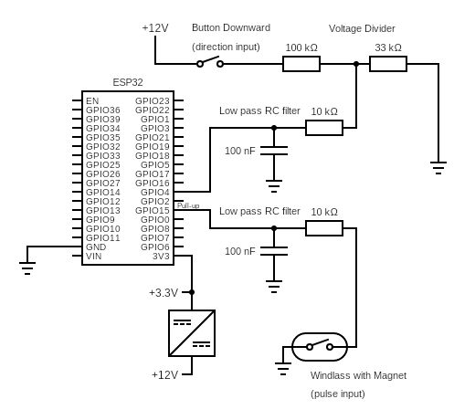
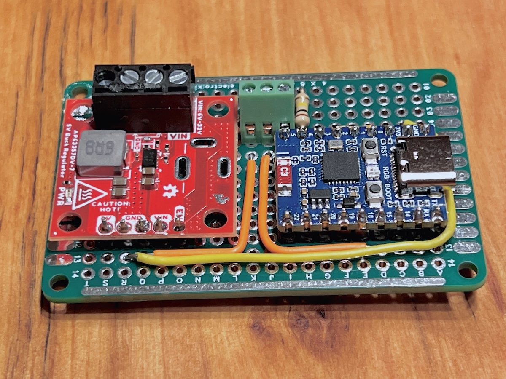
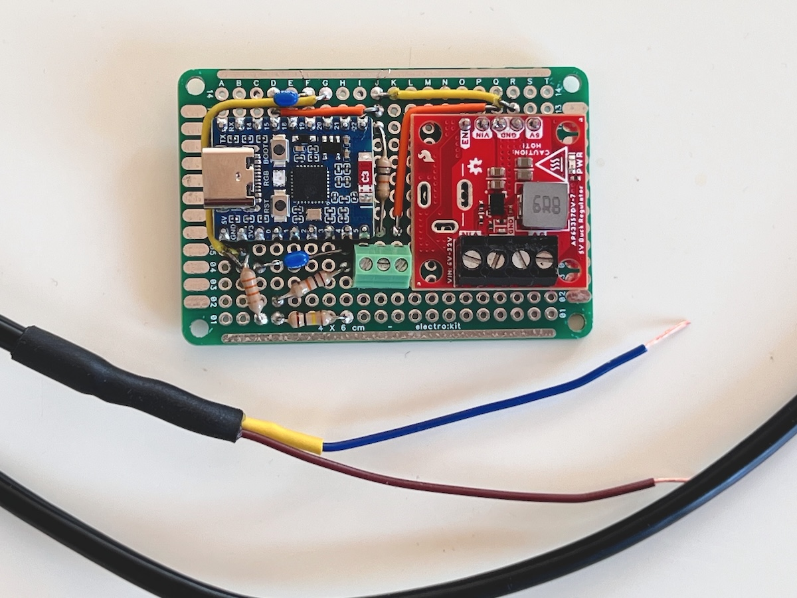
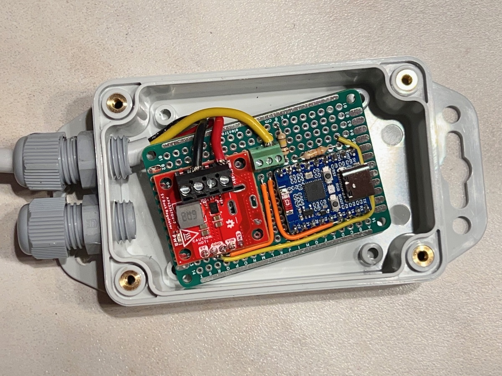
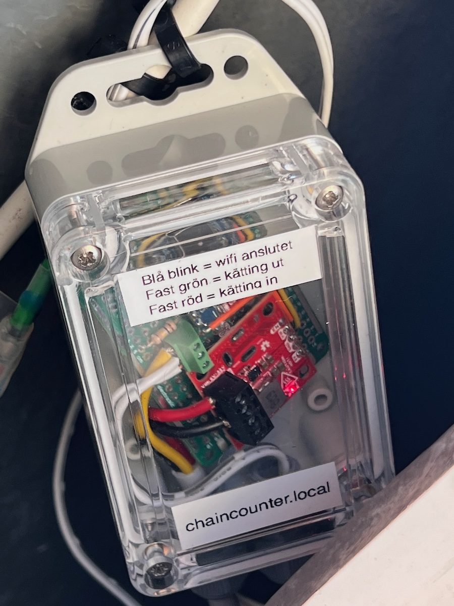
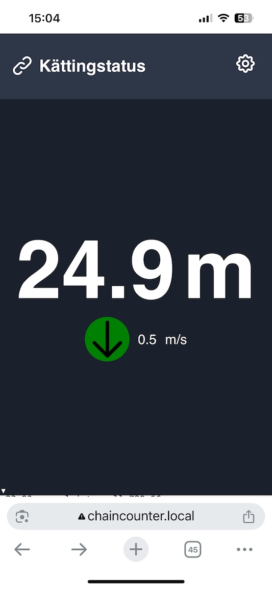
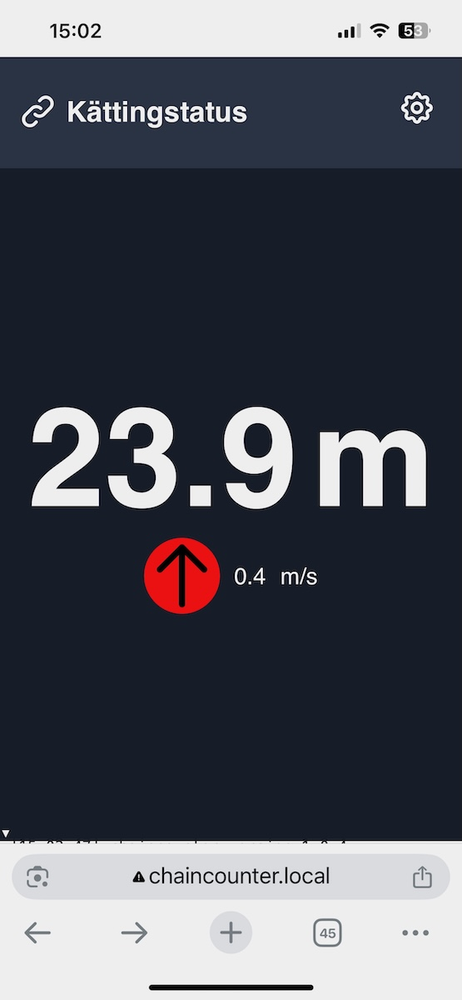

# Chain Counter

## Project Overview

This is an ESP32-based marine chain counter system (anchor rode meter) that tracks chain length and deployment speed in real-time. The system uses:

- **Hardware**: ESP32 microcontroller with magnetic pulse sensor and direction pin
- **Connectivity**: WiFi with captive portal setup, optional MQTT for SignalK integration
- **Interface**: Web-based dashboard with WebSocket real-time updates
- **Storage**: Non-volatile preferences for configuration persistence

## Hardware Installation

The chain counter is powered from the anchor windlass remote control connections:
- **12V power supply**: Main power from windlass control system
- **12V direction signal**: Signal voltage when anchor is being lowered (chain out), voltage divided to appropriate ESP32 input level using resistor chain
- **Magnetic sensor**: Normally-open magnetic proximity sensor mounted in base and magnet mounted on the rotating windlass component
- **Shielded cable**: Used for sensor connection to minimize interference from the windlass motor's high-current drive circuits

## Architecture

### Core Components

**ChainCounter.ino** - Main Arduino sketch containing:
- Interrupt-driven pulse counting with debouncing and filtering
- Adaptive speed calibration system that learns typical operating speeds
- Direction detection with hysteresis to prevent false toggles
- MQTT client with automatic reconnection and backoff
- WebSocket server for real-time web interface communication
- OTA (Over-The-Air) firmware updates
- Persistent configuration storage using ESP32 Preferences

**Assets.h/cpp** - Web assets stored in PROGMEM:
- HTML interface embedded as string literals
- CSS styling for responsive marine dashboard
- All web content is self-contained in the ESP32

**data/** directory - Development versions of web files:
- `index.html` - Web interface (duplicated in Assets.cpp)
- `style.css` - Stylesheet (duplicated in Assets.cpp)

### Key Features

- **Self-calibrating speed filter**: System learns normal operating speeds and filters out mechanical noise/bounce
- **Direction hysteresis**: Prevents false direction changes during chain slack
- **MQTT SignalK integration**: Publishes to standard marine data topics
- **Persistent state**: Chain length and calibration data survive power cycles
- **WiFi auto-configuration**: After restart, displays captive portal if WiFi is not available (unconfigured or network unavailable), otherwise connects automatically and makes web UI available at device IP
- **Real-time web interface**: Live updates via WebSocket with automatic reconnection
- **Localization support**: Multi-language web interface with browser language detection to auto switch

## Development Workflow

### Building and Uploading
- Use Arduino IDE or PlatformIO with ESP32 board package
- Upload via USB or OTA (password: "ota")
- Web interface accessible at device IP or `chaincounter.local`

### Configuration
- Chain calibration: Links per pulse and links per meter
- MQTT settings: Host, port, and SignalK topic configuration
- All settings persist in ESP32 flash memory

### Monitoring and Debugging
- Serial monitor at 115200 baud for debug output
- WebSerial console at `http://chaincounter.local/webserial`
- Available commands: `restart`, `ip`, `uptime`, `mq` (test MQTT)

### Key Constants
- `DEFAULT_LINKS_PER_PULSE = 10.0` - Chain links per encoder pulse
- `DEFAULT_LINKS_PER_METER = 40.0` - Chain density
- `INACTIVITY_MS = 2000` - Motion detection timeout
- `SAVE_INTERVAL_MS = 30000` - Automatic data persistence interval

### MQTT Topics (SignalK format)
- `vessels/self/navigation/anchor/rodeLength` - Chain deployed (meters)
- `vessels/self/navigation/anchor/rodeVelocity` - Deployment speed (m/s)

## Circuit Diagram

*Circuit diagram showing ESP32 connections to windlass remote control and magnetic sensor with voltage dividers and RC filters for signal conditioning*

## Hardware Photos

### Circuit Board Assembly

*Detailed view of the ESP32 C6 and power module connections*

*ESP32 C6 development board with power management module and shielded cable for magnet sensor*

*Complete chain counter unit in waterproof enclosure with cable glands*

### Finished Device

*Completed chain counter in transparent enclosure showing internal components and Swedish status labels*

### Web Interface

*Mobile web interface showing 24.9m chain deployed at 0.5 m/s speed (chain going out)*

*Mobile web interface showing 23.9m chain deployed at 0.4 m/s speed (chain coming in)*